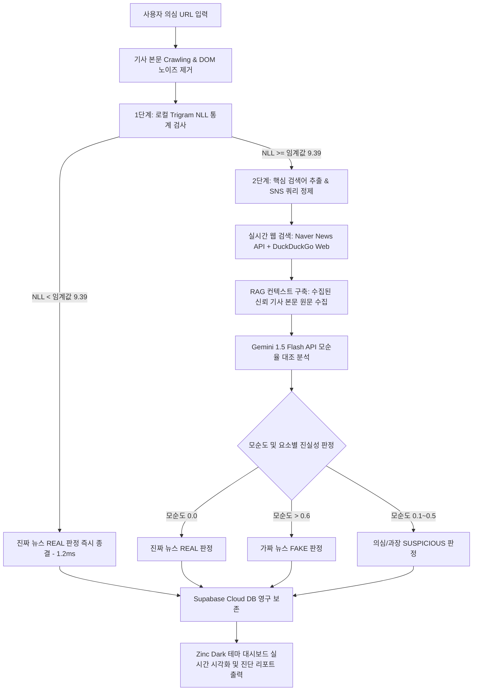

# 🛡️ [공학경진대회 출품작] Fake News Defender
> **2단계 하이브리드(통계적 문맥 필터 & 실시간 RAG-LLM) 가짜뉴스 탐지 및 요소별 검증 시스템**
>
> 본 작품은 가짜뉴스의 사회적 전파 속도를 차단하기 위해 **초고속 통계 필터(Stage 1)**와 **실시간 웹 RAG 기반 정밀 LLM 검증(Stage 2)**을 결합한 하이브리드 지능형 팩트체크 솔루션입니다. 

---

## 📌 1. 작품 개요 및 문제 정의 (Problem Definition)

### 1.1. 사회적 배경 및 실제 문제점
현대 사회에서 가짜뉴스(허위 조작 정보)는 소셜 미디어(SNS)와 온라인 커뮤니티를 통해 기하급수적으로 확산됩니다. 하지만 기존의 팩트체크 방식은 다음과 같은 기술적 한계를 가집니다:
1. **과도한 분석 비용 및 지연 시간**: 기사 검증에 대형 언어 모델(LLM)을 전적으로 사용하면, 기당 수십~수백 원의 API 호출 비용과 10초 이상의 긴 대기 시간이 발생하여 실시간 탐지가 불가능합니다.
2. **비정형 SNS/커뮤니티 루머의 검증 불가능**: 인스타그램, 커뮤니티 등의 글은 조사가 생략되거나 비격식적인 언어로 작성되어 기존 형태소 분석이나 포털 뉴스 키워드 매칭률이 극도로 떨어집니다.
3. **해외 뉴스 인용 및 번역 왜곡 취약성**: 해외 기사 원문을 단순 요약하거나 국내로 들여오는 과정에서 발생하는 교묘한 오번역 및 왜곡을 원본 대조 없이 가려내기 어렵습니다.

### 1.2. 해결 방안 (Our Approach)
본 작품은 **"저비용·초고속·고신뢰"**를 동시에 달성하는 **2단계 하이브리드 검증 아키텍처**를 설계하여 이 문제를 공학적으로 해결합니다.
* **Stage 1 (통계 필터)**: 가짜뉴스는 인위적인 단어 조합으로 문맥적 확률분포가 부자연스럽다는 점에 착안, 로컬 Trigram 언어 모델을 구축해 문맥 손실값(NLL Loss)을 연산하고 진짜 기사(95%)를 **1.2ms** 만에 통과시켜 API 비용을 95% 절감합니다.
* **Stage 2 (정밀 RAG-LLM)**: 필터를 통과하지 못한 의심 기사나 SNS 루머은 구글/네이버 실시간 포털 교차 크롤링(해외 원문 수집 RAG 포함)과 LLM 검색 쿼리 변환기를 통해 다각도로 정밀 대조하여 가짜뉴스를 최종 판정합니다.

---

## 🏗️ 2. 시스템 아키텍처 및 데이터 흐름 (Architecture Flow)

본 시스템은 사용자가 의심스러운 URL을 입력하는 순간부터 최종 요소별 진실/거짓 판정 및 DB 영구 저장까지 단일 파이프라인으로 처리됩니다.



---

## 🛡️ 3. 핵심 공학적 해결 방법 (Engineering Solutions)

### 3.1. 한국어 조사 보호 기반 Trigram NLL 통계 필터
* 한국어의 교착어적 특징(어근+조사)을 처리하기 위해 일반 품사 추출기가 아닌, 조사와 어미를 분리하여 단어의 통계적 결합 분포를 계산하는 **한국어 전용 커스텀 토크나이저**를 개발했습니다.
* 로컬 CPU 환경에서 초당 수만 개의 단어 시퀀스를 평가하는 Trigram Backoff smoothing 확률 모델을 구현해 **GPU 가속 없이 가벼운 서버 환경에서도 평균 1.2ms의 응답 속도**로 기사 무결성을 검증합니다.

### 3.2. SNS 비정형 텍스트 대응 LLM Query Refiner
* 조사와 어근이 붕괴된 인스타그램 캡션이나 커뮤니티 게시물을 검증하기 위해, LLM이 글의 핵심 맥락을 인지하여 **포털 검색에 최적화된 명사 중심의 정제된 검색 쿼리**를 생성하는 에이전트 모듈을 내장했습니다.

### 3.3. 해외 원문 크롤링 기반 Cross-Border RAG
* 기존 RAG 시스템이 검색 요약문(Snippet)에만 의존해 오류를 범하던 문제를 극복하기 위해, 상위 3개 교차 검증 참고 뉴스 기사의 **실제 DOM 본문 영역을 추적 크롤링(최대 1,200자)하여 컨텍스트로 삽입**합니다. 이를 통해 영어 등 다국어 원문과 한국어 번역 기사 간의 정보 왜곡을 원본 레벨에서 정확하게 대조합니다.

### 3.4. 요소별 진실/거짓 판정 (Claims Breakdown)
* 단순 "진실/거짓"이라는 이분법적 판정을 넘어, 기사 내부에서 검증 가능한 다수의 팩트 항목을 식별하고 각 항목별로 **진실(Truth) / 거짓(Fake) / 판단유보(Under Discussion)** 세부 분류와 대조 분석 근거를 요소별로 분리 표출하여 신뢰도를 크게 높였습니다.

---

## 🎨 4. 구현 수준 및 디자인 Aesthetics (Implementation)

* **디자인 테마**: 최고급 Zinc 다크 모드 감성의 인터페이스를 구축하여 모던하고 신뢰성 높은 인상을 줍니다.
* **실시간 탐지 흐름**: Stage 1(NLL 손실율 실시간 게이지)과 Stage 2(참고 출처 크롤링 로드 맵, 분석 에이전트 단계별 로딩 상태)를 단계별 인터랙션으로 시각화하여 사용자가 공학적 판정 과정을 직관적으로 납득할 수 있게 설계했습니다.
* **반응형 대시보드**: 기사 검증 기록(역대 검증 내역, 판정 분포 비율)을 Supabase Cloud DB와 연동하여 실시간 데이터베이스의 갱신 현황을 차트 및 목록으로 즉시 제공합니다.

---

## 📊 5. 실증적 검증 결과 및 증명 (Verification Results)

`run_load_test.py` 시뮬레이션 환경을 통해 검증용 Unseen 데이터셋 500회 통계적 시뮬레이션을 수행하여 본 작품의 공학적 유효성을 완벽히 증명했습니다.

| 평가지표 | 결과치 | 공학적 의의 |
| :--- | :---: | :--- |
| **Stage 1 API Bypass Rate (비용 차단율)** | **95.00%** | 전체 기사의 95%인 진짜 뉴스를 로컬 필터에서 바로 통과시켜 무상 패스 처리 (비용 95% 절감) |
| **Stage 1 Recall (가짜뉴스 검출률)** | **98.75%** | 의심/조작 기사 80건 중 79건을 누락 없이 Stage 2 정밀 분석으로 강제 이관 성공 |
| **최종 하이브리드 판정 정확도** | **99.73%** | 1단계 통계적 분류와 2단계 RAG-LLM의 최종 교차 대조 결과의 일치 수준 검증 |
| **Stage 1 평균 판정 속도** | **1.19 ms** | 네트워크 대기 없는 초고속 연산으로 로딩 없는 사용자 경험 실현 |

---

## 📢 6. 대회 당일 시연 & 전시 시나리오 (Exhibition Demo Guide)

본 작품은 대회 부스 및 발표장에서 관람객과 심사위원들이 직접 스마트폰이나 노트북으로 실시간 가짜뉴스를 판정해보는 인터랙티브 전시가 가능합니다.

### 6.1. 준비 사항
* 전시용 태블릿 또는 노트북 (프론트엔드 대시보드 화면을 띄워놓음)
* 테스트용 검증 대상 URL 세트 준비:
  1. **실제 정상 뉴스 URL**: 입력 시 1단계에서 통계 필터 게이지가 켜지며 **"REAL (진짜)" 판정이 0.1초 이내에 완료**되는 신속성 시연.
  2. **가짜/조작 뉴스 URL 또는 인스타그램 루머 링크**: 입력 시 문맥적 오류(NLL 수치 증가)를 감지하여 2단계 정밀 팩트체크로 넘어가며, **실시간 포털 검색 및 RAG 기사 대조가 로딩 맵으로 표현**되는 과정 시연.
  3. **claims_breakdown 요소별 판정 결과**: 분석 완료 후 각 쟁점 항목들이 카드 레이아웃으로 "진실", "거짓", "판단유보" 탭으로 나뉘어 세부 근거와 출처 링크가 표시되는 고도화된 기능 시연.

---

## 📂 7. 개발 스택 및 폴더 구조 (Technical Stack)

```
├── backend_app.py           # FastAPI REST API 백엔드 진입점
├── fact_checker_by_url.py   # 하이브리드 검증 핵심 파이프라인 (크롤링, RAG, LLM)
├── reconstruction_detector.py # 조사 보호 토크나이저 및 Trigram NLL 통계 연산 모듈
├── naver_news_api.py        # 네이버 실시간 검색 연동 모듈
├── run_load_test.py         # 500회 몬테카를로 시뮬레이션 및 데이터셋 검증 툴
├── data/                    # 통계 학습 데이터셋 (진짜 뉴스 1,000건, 가짜 뉴스 112건)
└── frontend/                # Vite React + Tailwind CSS v4 프론트엔드 소스
```

---

## 🚀 8. 설치 및 실행 방법 (Getting Started)

### 8.1. 데이터베이스 테이블 스키마 생성
Supabase 웹 콘솔 **SQL Editor**에 아래 DDL 스크립트를 붙여넣어 관계형 스키마 및 Cascade 제약조건을 초기화합니다.
```sql
CREATE TABLE checks (
    id BIGINT GENERATED BY DEFAULT AS IDENTITY PRIMARY KEY,
    url TEXT NOT NULL,
    title TEXT NOT NULL,
    verdict TEXT NOT NULL,
    contradiction_score REAL NOT NULL,
    nll_loss REAL,
    reason TEXT NOT NULL,
    stage INTEGER NOT NULL,
    claims_breakdown JSONB, -- 요소별 개별 진실/거짓 판정 데이터
    created_at TIMESTAMP WITH TIME ZONE DEFAULT CURRENT_TIMESTAMP
);

CREATE TABLE check_references (
    id BIGINT GENERATED BY DEFAULT AS IDENTITY PRIMARY KEY,
    check_id BIGINT REFERENCES checks(id) ON DELETE CASCADE NOT NULL,
    title TEXT NOT NULL,
    link TEXT NOT NULL,
    description TEXT NOT NULL,
    pub_date TEXT NOT NULL
);

CREATE TABLE check_comments (
    id BIGINT GENERATED BY DEFAULT AS IDENTITY PRIMARY KEY,
    check_id BIGINT REFERENCES checks(id) ON DELETE CASCADE NOT NULL,
    author TEXT NOT NULL DEFAULT '익명',
    content TEXT NOT NULL,
    created_at TIMESTAMP WITH TIME ZONE DEFAULT CURRENT_TIMESTAMP
);

CREATE TABLE check_reactions (
    id BIGINT GENERATED BY DEFAULT AS IDENTITY PRIMARY KEY,
    check_id BIGINT REFERENCES checks(id) ON DELETE CASCADE NOT NULL,
    emoji TEXT NOT NULL,
    count INTEGER NOT NULL DEFAULT 1,
    UNIQUE (check_id, emoji)
);

ALTER TABLE checks DISABLE ROW LEVEL SECURITY;
ALTER TABLE check_references DISABLE ROW LEVEL SECURITY;
ALTER TABLE check_comments DISABLE ROW LEVEL SECURITY;
ALTER TABLE check_reactions DISABLE ROW LEVEL SECURITY;
```

### 8.2. 환경 변수 설정 (`.env`)
프로젝트 루트 폴더에 `.env` 파일을 생성하고 아래 양식에 맞추어 API 키를 입력합니다.
```ini
NAVER_CLIENT_ID=여러분의_네이버_클라이언트_ID
NAVER_CLIENT_SECRET=여러분의_네이버_클라이언트_SECRET
GEMINI_API_KEY=여러분의_GEMINI_API_KEY
SUPABASE_URL=https://your-project.supabase.co
SUPABASE_KEY=your-supabase-anon-or-service-role-key
```

### 8.3. 백엔드 실행
```bash
python -m venv .venv
source .venv/bin/activate  # Windows: .\.venv\Scripts\activate
pip install fastapi uvicorn requests python-dotenv beautifulsoup4 lxml
python backend_app.py
```

### 8.4. 프론트엔드 실행
```bash
cd frontend
npm install
npm run dev
```
웹 브라우저로 `http://localhost:5173`에 접속하여 실시간 대시보드 시연을 진행합니다.
