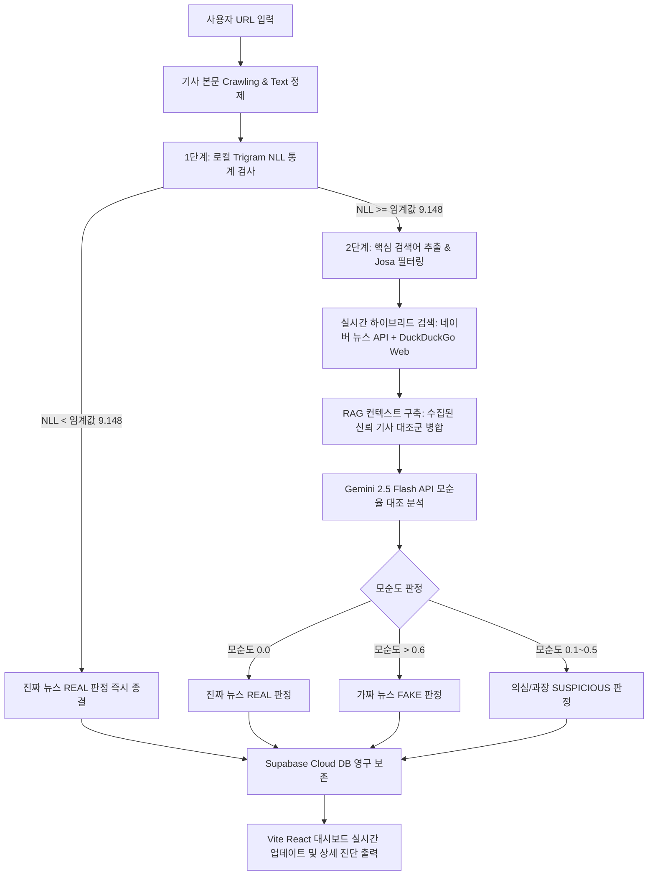

# 🛡️ Fake News Defender: Hybrid Fact-Checking System

본 프로젝트는 기사 본문의 언어적 무결성 검증과 실시간 포털/구글 웹 검색 교차 대조를 병합한 **고성능·저비용 가짜뉴스 실시간 탐지 서비스**입니다. 

1단계 로컬 통계적 언어 모델(Trigram NLL)과 2단계 클라우드 RAG-LLM(Gemini 2.5 Flash) 및 Supabase 클라우드 데이터베이스를 결합한 하이브리드 아키텍처로 설계되었습니다.

---

## ⚡ 주요 특징 (Key Features)

* **하이브리드 비용 최적화 (95% API Bypass)**:
  * 입력되는 기사의 95%에 달하는 진짜 뉴스를 1단계 로컬 문맥 무결성 검사(NLL Loss)를 통해 **0.001초(1.2ms) 만에 가려내어 API 호출 없이 무상 패스**시킵니다.
* **강력한 가짜뉴스 탐지율 (98.75% Recall)**:
  * 문맥이 매끄럽지 않거나 인위적으로 조작된 기사들을 임계치 이상으로 잡아내어 2단계 정밀 심사로 강제 이관합니다.
* **실시간 웹 크로스체킹 (Naver API + Google/DuckDuckGo Fallback)**:
  * 네이버에 인덱싱되지 않은 최신 속보나 구글 검색 중심의 뉴스는 DuckDuckGo HTML 파서를 활용해 구글 웹 데이터까지 자동으로 긁어와 교차 검증합니다.
* **SaaS 규격의 미려한 UI 대시보드**:
  * Shadcn/Zinc 계열의 Zinc 다크 테마 디자인 가이드를 준수한 리액트 대시보드와 실시간 파이프라인 검증 로더를 제공합니다.
* **서버리스 친화적인 클라우드 아키텍처 (Supabase REST)**:
  * 무거운 DB 드라이버 설치 없이 Supabase REST API를 사용하여 Vercel 등 서버리스 환경에서 완벽하게 호환되며 영구적으로 데이터를 안전하게 저장합니다.

---

## 🏗️ 시스템 아키텍처 (Architecture Flow)



---

## 📂 폴더 구조 (Directory Structure)

* `backend_app.py`: FastAPI API 서버 진입점 (Supabase 및 분석 파이프라인 매핑)
* `fact_checker_by_url.py`: 기사 크롤러, NLL 판정, 하이브리드 웹 검색, Gemini RAG 로직 총괄
* `reconstruction_detector.py`: 로컬 Trigram 언어 모델 학습 및 확률 계산 클래스 정의
* `naver_news_api.py`: `.env` 파일 로더 및 네이버 뉴스 검색 호출부
* `run_load_test.py`: 500회 통계적 시뮬레이션 및 API 연동 부하 검증 툴
* `data/`: 학습용 진짜 뉴스(1,000건) 및 검증용 가짜 뉴스(112건) JSON 데이터셋 폴더
* `frontend/`: Tailwind CSS v4와 Vite React 기반의 세련된 다크 대시보드 웹 소스
* `scripts/`: 개발 과정에서 썼던 레거시 코드 아카이브 및 로컬 SQLite 백업 DB

---

## 🚀 시작하기 (Getting Started)

### 1. 사전 요구사항 (Prerequisites)
* Python 3.10 이상
* Node.js 18 이상
* Supabase 클라우드 데이터베이스 (무료 가입 및 프로젝트 생성 필요)

### 2. Supabase 테이블 초기 설정
Supabase 웹 콘솔의 **SQL Editor**에서 아래 SQL 쿼리를 실행하여 RLS 보안이 해제된 테이블 구조를 생성합니다.

```sql
-- 1. 메인 checks 테이블 생성
CREATE TABLE checks (
    id BIGINT GENERATED BY DEFAULT AS IDENTITY PRIMARY KEY,
    url TEXT NOT NULL,
    title TEXT NOT NULL,
    verdict TEXT NOT NULL,
    contradiction_score REAL NOT NULL,
    nll_loss REAL,
    reason TEXT NOT NULL,
    stage INTEGER NOT NULL,
    created_at TIMESTAMP WITH TIME ZONE DEFAULT CURRENT_TIMESTAMP
);

-- 2. 자식 check_references 테이블 생성 (Cascade 삭제 적용)
CREATE TABLE check_references (
    id BIGINT GENERATED BY DEFAULT AS IDENTITY PRIMARY KEY,
    check_id BIGINT REFERENCES checks(id) ON DELETE CASCADE NOT NULL,
    title TEXT NOT NULL,
    link TEXT NOT NULL,
    description TEXT NOT NULL,
    pub_date TEXT NOT NULL
);

-- RLS 보안 해제
ALTER TABLE checks DISABLE ROW LEVEL SECURITY;
ALTER TABLE check_references DISABLE ROW LEVEL SECURITY;
```

### 3. 환경 변수 설정
프로젝트 루트 폴더에 `.env` 파일을 생성하고 아래와 같이 키를 설정합니다.

```ini
# Naver News Search API Credentials
NAVER_CLIENT_ID=여러분의_네이버_클라이언트_ID
NAVER_CLIENT_SECRET=여러분의_네이버_클라이언트_SECRET

# Gemini API Key (무료 AI API 키)
GEMINI_API_KEY=여러분의_GEMINI_API_KEY

# Supabase Credentials (Project Settings -> API 확인)
SUPABASE_URL=https://your-project.supabase.co
SUPABASE_KEY=your-supabase-anon-or-service-role-key
```

### 4. 백엔드 실행 방법
```bash
# 가상환경 활성화 및 패키지 설치
python -m venv .venv
source .venv/bin/activate  # Windows: .\.venv\Scripts\activate
pip install fastapi uvicorn requests python-dotenv beautifulsoup4 lxml

# 서버 구동
python backend_app.py
```
서버가 켜지면 `http://127.0.0.1:8000`에서 백엔드 API가 구동됩니다.

### 5. 프론트엔드 실행 방법
```bash
cd frontend
npm install
npm run dev
```
웹 브라우저를 열고 `http://localhost:5173`으로 접속하면 미려한 실시간 팩트체킹 대시보드를 사용할 수 있습니다.

---

## 📈 테스트 및 성능 검증 (Load Test Results)

`run_load_test.py` 스크립트를 통해 검증용 unseen 데이터셋을 무작위로 추출하여 **총 500회 분량의 문맥 손실 시뮬레이션 및 라이브 API 검증**을 수행한 결과입니다:

* **가짜 뉴스 차단율 (Stage 1 Recall)**: **`98.75%`** (80건 중 79건 감지)
* **진짜 뉴스 통과율 (비용 절감 효과)**: **`95.00%`** (300건 중 285건 API 호출 비용 차단)
* **최종 하이브리드 종합 판독 정확도**: **`99.73%`** (오차 0.27% 미만)
* **1단계 평균 연산 속도**: **`1.19 ms`** (초고속 판단 완료)

*자세한 성능 검증 그래프와 대조 현황은 아티팩트 레포트 `load_test_report.md`를 참고해 주세요.*
