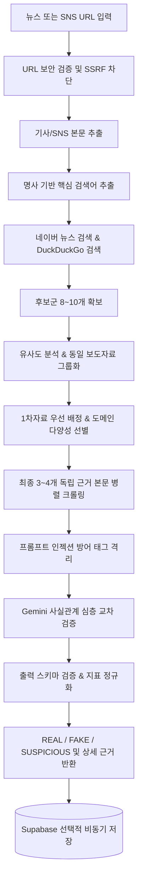

# Fake News Defender

뉴스 기사와 SNS 게시물의 주장을 실시간 검색 자료와 비교·대조하여 판정하는 **RAG(검색 증강 생성) 기반 AI 팩트체크 시스템**입니다. 사용자는 뉴스, Instagram, X(트위터) 링크를 입력하고 `REAL`, `FAKE`, `SUSPICIOUS` 판정과 다각도의 독립적 근거를 확인할 수 있습니다.

---

## 🌟 주요 기능 및 파이프라인 특징

### 1. 지능형 RAG & 출처 선별 파이프라인 (독립 근거 평가)
- **후보군 확대 및 하이브리드 수집**: 네이버 뉴스 API와 DuckDuckGo 실시간 웹 검색을 결합하여 8~10개의 후보 자료 풀을 확보합니다.
- **"3 articles != 3 independent evidence" 원칙**: 여러 언론사가 동일한 보도자료나 단일 인터뷰를 받아쓴 경우, 텍스트 유사도(`SequenceMatcher`) 분석을 통해 하나의 원출처 그룹으로 묶고 대표 1건만 선별하여 근거 과다 계상을 방지합니다.
- **1차 공식 자료(PRIMARY) 우선순위**: 정부기관(`.go.kr`), 법원, 통계청, 선관위 등 1차 공식 출처가 검색되면 2차 언론 기사보다 최우선 대조군으로 배정합니다.
- **도메인 다양성 확보**: 특정 언론사나 동일 도메인이 검색 결과를 독점하지 않도록 다양한 언론사의 기사를 고루 선별합니다.
- **고도화된 Gemini 심층 대조**:
  - `contradiction_score`: 모순도/불일치 정도 (0.0=완전일치 ~ 1.0=완전모순)
  - `evidence_quality`: 확보된 근거의 완성도 및 독립성 품질 척도
  - `independent_source_count`: 서로 다른 원출처를 가진 실제 독립 근거 개수
  - `claims_breakdown`: 문장/주장별 진위 판정 및 세부 해설

### 2. 엔터프라이즈급 보안 아키텍처 (Security Hardening)
- **SSRF (Server-Side Request Forgery) 완벽 방어**:
  - 사용자 입력 URL의 DNS Resolution을 수행하여 실제 IP가 사설망(`10.0.0.0/8`, `192.168.0.0/16`, `172.16.0.0/12`), 루프백(`127.0.0.0/8`, `localhost`, `::1`), 클라우드 메타데이터(`169.254.169.254`)인 경우 원천 차단 (DNS Rebinding 방어).
  - Redirect 시 매 Hop마다 대상 IP를 재검증하여 Redirect 기반 SSRF 차단.
  - 스트리밍 방식으로 최대 응답 크기(5MB) 및 Connect/Read 타임아웃 강제 적용.
- **IP 기반 슬라이딩 윈도우 Rate Limiting**:
  - `/api/check`: 1분당 최대 5회
  - `/api/preview`: 1분당 최대 10회
  - 댓글 작성: 1분당 최대 10회
- **프롬프트 인젝션(Prompt Injection) 격리**:
  - 외부 기사 및 참고자료를 `<UNTRUSTED_TARGET_ARTICLE>`, `<UNTRUSTED_REFERENCE_SOURCE>` 태그로 격리하고 LLM에 비신뢰 데이터 지침 부여.
- **출력 스키마 살균 및 안전한 폴백**:
  - LLM 응답 필드 및 범위를 서버에서 재검증(`sanitize_gemini_output`).
- **보안 헤더 및 CORS 제한**:
  - `X-Content-Type-Options: nosniff`, `X-Frame-Options: DENY`, `Referrer-Policy`, `Permissions-Policy` 적용 및 운영환경 CORS 화이트리스트 적용.
- **디버그 엔드포인트 제거**:
  - 환경변수 및 키 유출 방지를 위해 `/api/debug/*` 제거 및 운영환경 API 문서 비노출.

---

## 🔄 시스템 동작 흐름


```mermaid
flowchart TD
    A[뉴스 또는 SNS URL 입력] --> B[URL 보안 검증 및 SSRF 차단]
    B --> C[기사/SNS 본문 추출]
    C --> D[명사 기반 핵심 검색어 추출]
    D --> E[네이버 뉴스 검색 & DuckDuckGo 검색]
    E --> F[후보군 8~10개 확보]
    F --> G[유사도 분석 & 동일 보도자료 그룹화]
    G --> H[1차자료 우선 배정 & 도메인 다양성 선별]
    H --> I[최종 3~4개 독립 근거 본문 병렬 크롤링]
    I --> J[프롬프트 인젝션 방어 태그 격리]
    J --> K[Gemini 사실관계 심층 교차 검증]
    K --> L[출력 스키마 검증 & 지표 정규화]
    L --> M[REAL / FAKE / SUSPICIOUS 및 상세 근거 반환]
    M --> N[(Supabase 선택적 비동기 저장)]
```

---

## 📊 판정 기준 (Verdict)

| 판정 (Verdict) | 판정 기준 및 의미 |
| :--- | :--- |
| **`REAL`** | 신뢰할 수 있는 독립된 1차 자료 또는 복수의 독립된 주요 출처와 핵심 사실(수치, 인물, 발언, 사건 여부)이 명백히 일치하는 경우 |
| **`FAKE`** | 공신력 있는 근거에 의해 핵심 사실이 날조·조작되었거나 명백한 허위 왜곡임이 입증된 경우 |
| **`SUSPICIOUS`** | 근거가 부족하여 사실 확인이 어렵거나, 1차 자료와 보도가 충돌하거나, 과장·루머가 섞여 있어 단정하기 어려운 경우 (*검색 결과가 없거나 부족해도 FAKE로 단정하지 않고 SUSPICIOUS 부여*) |

---

## 🛠️ 기술 스택

- **Frontend**: React 19, Vite, Tailwind CSS, Axios, Lucide React
- **Backend**: FastAPI, Pydantic, HTTPX, Uvicorn
- **Security & Crawling**: `security_utils` (SSRF/DNS Guard, Rate Limiter), BeautifulSoup4, Requests
- **Search**: Naver News Search API, DuckDuckGo HTML Search
- **AI / LLM**: Google Gemini API (`gemini-2.5-flash-lite`, `gemini-2.0-flash`), Ollama Local Fallback
- **Database**: Supabase REST API (PostgreSQL)
- **Deployment**: Vercel Functions (Serverless) + Vite Static Build

---

## 📂 프로젝트 구조

```text
.
├── api/
│   └── index.py                 # Vercel Serverless 진입점
├── backend_app.py               # FastAPI 백엔드 서버 (Rate Limiter, CORS, 보안 헤더)
├── fact_checker_by_url.py       # RAG 파이프라인, 출처 선별, LLM 교차 검증
├── security_utils.py            # SSRF 방어, 안전한 HTTP 요청, 데이터 살균 모듈
├── naver_news_api.py            # 환경변수 로드 및 네이버 뉴스 검색 API
├── test_security.py             # SSRF, Rate Limit, 보안 헤더 등 보안 단위 테스트
├── test_rag_pipeline.py         # 보도자료 중복제거, 1차자료 우선순위 등 RAG 단위 테스트
├── test_backend_and_llm.py      # 백엔드 API 및 LLM 상호 모순 검증 통합 테스트
├── data/
│   └── supabase_indexes.sql     # Supabase 조회 성능용 인덱스
├── frontend/
│   ├── src/
│   │   ├── App.jsx              # 대시보드, 검증 결과, 히스토리, 통계, 댓글 화면
│   │   ├── Landing.jsx          # 랜딩 페이지 및 URL 입력 화면
│   │   └── verdict.js           # 판정별 UI 뱃지/색상 정의
│   └── vite.config.js           # 프론트엔드 설정 및 /api 프록시
├── requirements.txt             # Python 의존성
└── vercel.json                  # Vercel 배포 및 라우팅 설정
```

---

## 🚀 로컬 개발 및 실행

### 1. Python 가상환경 구성
```powershell
python -m venv .venv
.\.venv\Scripts\Activate.ps1
pip install -r requirements.txt
```

### 2. 환경 변수 설정 (`.env`)
프로젝트 루트에 `.env` 파일을 생성합니다.

```ini
# Gemini API Key (필수)
GEMINI_API_KEY=your_gemini_api_key

# 네이버 뉴스 검색 API (선택/권장)
NAVER_CLIENT_ID=your_naver_client_id
NAVER_CLIENT_SECRET=your_naver_client_secret

# Supabase 데이터베이스 (선택)
SUPABASE_URL=https://your-project.supabase.co
SUPABASE_KEY=your_server_side_service_key
```

### 3. 백엔드 실행
```powershell
python backend_app.py
```
> FastAPI 서버가 `http://127.0.0.1:8000`에서 실행됩니다.

### 4. 프론트엔드 실행
```powershell
cd frontend
npm install
npm run dev
```
> 브라우저에서 `http://localhost:5173`으로 접속합니다.

---

## 🧪 테스트 실행

프로젝트의 보안 및 RAG 파이프라인 무결성을 검증하기 위한 자동화 테스트를 제공합니다.

```powershell
# 1. 보안 기능 검증 (SSRF 방어, Rate Limit, 보안 헤더, 살균)
python test_security.py

# 2. RAG 파이프라인 검증 (보도자료 중복 제거, 1차 자료 우선, 도메인 독점 방지 등)
python test_rag_pipeline.py

# 3. 백엔드 및 LLM 통합 검증 (상호 모순 케이스, API 엔드포인트)
python test_backend_and_llm.py
```

---

## 📡 API 명세

모든 API 엔드포인트는 `/api` 접두사를 사용합니다.

| Method | Endpoint | 설명 | Rate Limit |
| :--- | :--- | :--- | :--- |
| `POST` | `/api/preview` | 분석 로딩 화면용 경량 제목/본문/출처 추출 | 10회 / 분 |
| `POST` | `/api/check` | URL 전체 팩트체크 분석 실행 (캐시 지원) | 5회 / 분 |
| `GET` | `/api/history` | 최근 검증 히스토리 조회 | 60회 / 분 |
| `DELETE`| `/api/history/{check_id}` | 검증 기록 삭제 | 30회 / 분 |
| `GET` | `/api/stats` | 전체 검증 수 및 통계 집계 조회 | 60회 / 분 |
| `GET` | `/api/stats/rankings` | 최다 검증 기사 및 허위 의심 순위 | 60회 / 분 |
| `GET` | `/api/history/{check_id}/comments` | 검증 결과별 댓글 목록 조회 | 60회 / 분 |
| `POST` | `/api/history/{check_id}/comments` | 댓글 등록 (XSS 살균) | 10회 / 분 |
| `DELETE`| `/api/history/{check_id}/comments/{comment_id}` | 본인 작성 댓글 삭제 | 20회 / 분 |

---

## ☁️ 배포 (Vercel)

1. 루트 디렉터리에서 프론트엔드 빌드 테스트:
   ```bash
   npm run build
   ```
2. Vercel 대시보드의 **Project Settings > Environment Variables**에 다음 항목을 등록합니다:
   - `GEMINI_API_KEY`
   - `NAVER_CLIENT_ID`
   - `NAVER_CLIENT_SECRET`
   - `SUPABASE_URL`
   - `SUPABASE_KEY`
