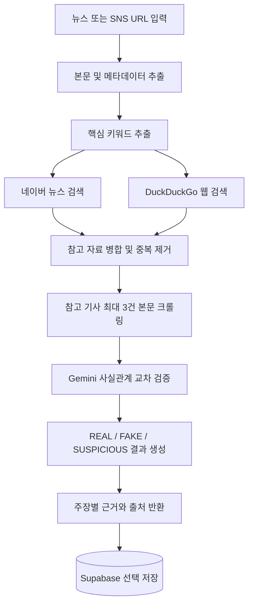

# Fake News Defender

뉴스 기사와 SNS 게시물의 주장을 실시간 검색 자료와 비교하는 AI 팩트체크 서비스입니다. 사용자는 뉴스, Instagram, X(트위터) 링크를 입력하고 `REAL`, `FAKE`, `SUSPICIOUS` 판정과 근거를 확인할 수 있습니다.

이 문서는 현재 저장소의 구현을 기준으로 작성되었습니다.

## 주요 기능

- 뉴스 기사 URL의 제목과 본문 추출
- Instagram 및 X(트위터) 게시물 링크 처리
- 네이버 뉴스 API와 DuckDuckGo HTML 검색을 결합한 실시간 참고 자료 수집
- 참고 기사 본문을 추가로 크롤링해 Gemini와 교차 검증
- `REAL`, `FAKE`, `SUSPICIOUS` 판정
- 기사 전체 판정 근거와 주장별 세부 판정(`claims_breakdown`) 표시
- 교차 검증 출처와 원문 링크 제공
- Supabase 기반 검증 히스토리, 통계, 댓글 저장
- 최근 검증 결과 캐시와 가장 많이 검증된 기사 목록
- Vite 개발 서버와 Vercel 서버리스 배포 지원

## 동작 흐름


```mermaid
flowchart TD
    A[뉴스 또는 SNS URL 입력] --> B[본문 및 메타데이터 추출]
    B --> C[핵심 키워드 추출]
    C --> D[네이버 뉴스 검색]
    C --> E[DuckDuckGo 웹 검색]
    D --> F[참고 자료 병합 및 중복 제거]
    E --> F
    F --> G[참고 기사 최대 3건 본문 크롤링]
    G --> H[Gemini 사실관계 교차 검증]
    H --> I[REAL / FAKE / SUSPICIOUS 결과 생성]
    I --> J[주장별 근거와 출처 반환]
    J --> K[(Supabase 선택 저장)]
```

검증 요청은 다음과 같이 처리됩니다.

1. URL 형식을 확인하고 기사 또는 SNS 본문을 추출합니다.
2. 본문에서 검색용 핵심 키워드를 만들어 네이버와 DuckDuckGo에서 참고 자료를 찾습니다.
3. 병합된 참고 자료 중 최대 3건의 실제 본문을 가져옵니다.
4. Gemini가 검증 대상과 참고 자료를 비교해 판정 근거와 주장별 결과를 생성합니다.
5. Supabase가 설정되어 있으면 결과와 참고 출처를 저장합니다. 설정되지 않은 경우에도 분석 결과는 반환되지만 히스토리와 통계는 비어 있습니다.

## 판정 결과

| 값 | 의미 |
| --- | --- |
| `REAL` | 참고 자료와 주요 사실관계가 대체로 일치하는 기사 |
| `FAKE` | 핵심 사실, 수치, 발언 또는 사건이 명백히 왜곡되거나 조작된 경우 |
| `SUSPICIOUS` | 과장 또는 미확인 주장이 포함되어 추가 확인이 필요한 경우 |

분석 결과에는 전체 `reason`, 주장별 `claims_breakdown`, 교차 검증 `sources`가 포함됩니다. 모순율은 화면에서 퍼센트로 표시되며, 내부 API와 데이터베이스에는 `contradiction_score` 값으로 저장됩니다.

## 기술 스택

- Frontend: React 19, Vite, Tailwind CSS, Axios, Lucide React
- Backend: FastAPI, Pydantic, HTTPX
- Crawling: Requests, BeautifulSoup4, lxml
- Search: Naver News Search API, DuckDuckGo HTML search
- LLM: Google Gemini API
- Persistence: Supabase REST API
- Deployment: Vercel Functions + Vite static build

## 프로젝트 구조

```text
.
├── api/index.py                 # Vercel에서 FastAPI 앱을 노출하는 진입점
├── backend_app.py               # FastAPI API 서버
├── fact_checker_by_url.py       # 크롤링, 검색, Gemini 검증 파이프라인
├── naver_news_api.py             # 환경변수 로드 및 네이버 뉴스 API 클라이언트
├── data/
│   └── supabase_indexes.sql      # Supabase 조회 성능용 인덱스
├── frontend/
│   ├── src/App.jsx               # 검증 결과, 히스토리, 통계, 댓글 화면
│   ├── src/Landing.jsx           # 첫 화면과 URL 입력 화면
│   ├── src/verdict.js            # 판정별 화면 스타일 규칙
│   └── vite.config.js            # 로컬 `/api` 프록시 설정
├── scripts/                      # 분석 및 부하 테스트용 보조 스크립트
├── run_load_test.py              # API 부하 테스트 스크립트
├── requirements.txt              # Python 의존성
├── package.json                  # 루트 빌드 명령
└── vercel.json                   # Vercel 빌드 및 라우팅 설정
```

## 로컬 실행

### 1. 사전 요구 사항

- Python 3.10 이상
- Node.js 18 이상
- 선택 사항: Naver Developers 애플리케이션, Google Gemini API 키, Supabase 프로젝트

### 2. Python 환경 설정

프로젝트 루트에서 실행합니다.

```powershell
python -m venv .venv
.\.venv\Scripts\Activate.ps1
pip install -r requirements.txt
```

macOS/Linux에서는 다음을 사용합니다.

```bash
python3 -m venv .venv
source .venv/bin/activate
pip install -r requirements.txt
```

### 3. 환경 변수 설정

프로젝트 루트에 `.env` 파일을 만들고 필요한 값을 입력합니다.

```ini
# Gemini 정밀 판정에 필요
GEMINI_API_KEY=your_gemini_api_key

# 네이버 뉴스 검색에 필요
NAVER_CLIENT_ID=your_naver_client_id
NAVER_CLIENT_SECRET=your_naver_client_secret

# 선택 사항. 설정하면 히스토리, 통계, 댓글을 사용할 수 있습니다.
SUPABASE_URL=https://your-project.supabase.co
SUPABASE_KEY=your_server_side_supabase_key
```

`SUPABASE_KEY`는 브라우저에 노출되지 않는 서버 측 키로 설정해야 합니다. `.env` 파일은 Git에 커밋하지 마세요.

### 4. Supabase 테이블 설정

Supabase SQL Editor에서 아래 스키마를 실행합니다.

```sql
create table if not exists checks (
  id bigint generated by default as identity primary key,
  url text not null,
  title text not null,
  verdict text not null,
  contradiction_score real not null,
  nll_loss real,
  reason text not null,
  stage integer not null,
  claims_breakdown jsonb,
  created_at timestamptz default current_timestamp
);

create table if not exists check_references (
  id bigint generated by default as identity primary key,
  check_id bigint references checks(id) on delete cascade not null,
  title text not null,
  link text not null,
  description text not null,
  pub_date text not null
);

create table if not exists check_comments (
  id bigint generated by default as identity primary key,
  check_id bigint references checks(id) on delete cascade not null,
  author text not null default '익명',
  content text not null,
  user_token text,
  created_at timestamptz default current_timestamp
);
```

테이블 생성 후 `data/supabase_indexes.sql`을 실행하면 히스토리 정렬과 통계 조회에 필요한 인덱스가 추가됩니다. 운영 환경에서는 Supabase RLS 정책과 서버 키 권한을 별도로 설정하세요.

### 5. 백엔드 실행

첫 번째 터미널에서 실행합니다.

```powershell
python backend_app.py
```

FastAPI 서버는 기본적으로 `http://127.0.0.1:8000`에서 실행됩니다.

### 6. 프론트엔드 실행

두 번째 터미널에서 실행합니다.

```powershell
cd frontend
npm install
npm run dev
```

브라우저에서 `http://localhost:5173`을 엽니다. Vite가 `/api` 요청을 로컬 FastAPI 서버인 `http://127.0.0.1:8000`으로 프록시합니다.

## API

모든 API 경로는 `/api` prefix를 사용합니다.

| Method | Path | 설명 |
| --- | --- | --- |
| `POST` | `/api/preview` | 분석 화면에 표시할 기사 제목, 본문, 출처를 빠르게 추출 |
| `POST` | `/api/check` | URL 전체 팩트체크 실행 |
| `GET` | `/api/history` | 검증 히스토리 조회 |
| `DELETE` | `/api/history/{check_id}` | 검증 결과 삭제 |
| `GET` | `/api/stats` | 전체 검사 수와 판정별 통계 조회 |
| `GET` | `/api/stats/rankings` | 많이 검증된 기사와 주요 의심 결과 조회 |
| `GET` | `/api/history/{check_id}/comments` | 결과별 댓글 조회 |
| `POST` | `/api/history/{check_id}/comments` | 결과에 댓글 추가 |
| `DELETE` | `/api/history/{check_id}/comments/{comment_id}` | 본인 댓글 삭제 |

검증 요청 본문은 다음과 같습니다.

```json
{
  "url": "https://example.com/news/article"
}
```

개발 중 환경 확인에는 `/api/debug/env`와 `/api/debug/gemini`를 사용할 수 있습니다. 이 엔드포인트는 운영 환경에서 인증 없이 공개하지 않는 것을 권장합니다.

## 빌드 및 배포

루트에서 프론트엔드 production build를 실행합니다.

```bash
npm run build
```

이 명령은 `frontend` 의존성을 설치한 뒤 `frontend/dist`를 생성합니다.

Vercel 배포 시에는 다음 환경 변수를 Project Settings에 등록합니다.

- `GEMINI_API_KEY`
- `NAVER_CLIENT_ID`
- `NAVER_CLIENT_SECRET`
- `SUPABASE_URL`
- `SUPABASE_KEY`

`vercel.json`이 `frontend/dist`를 정적 출력으로 사용하고 `/api/*` 요청을 `api/index.py`의 FastAPI 앱으로 연결합니다. 서버리스 실행 시간은 현재 설정상 최대 60초입니다.

## 문제 해결

- **히스토리와 통계가 비어 있음**: `SUPABASE_URL`과 `SUPABASE_KEY`가 설정되어 있는지, 테이블과 인덱스가 생성되어 있는지 확인합니다.
- **Gemini 판정이 `SUSPICIOUS`로 유보됨**: `GEMINI_API_KEY`가 유효한지와 API 사용량 제한을 확인합니다. 로컬에서는 Gemini 실패 시 Ollama 폴백을 시도할 수 있지만, Vercel 서버리스에서는 로컬 Ollama를 사용할 수 없습니다.
- **참고 출처가 부족함**: 네이버 키를 확인하고, DuckDuckGo 검색이 실행 가능한 네트워크인지 확인합니다.
- **프론트엔드에서 API 연결 실패**: FastAPI 서버가 8000 포트에서 실행 중인지 확인합니다. Vite 개발 서버는 `/api`를 8000 포트로 전달합니다.

## 개발 확인 명령

```bash
# 프론트엔드 production build
npm run build

# 프론트엔드 lint
cd frontend
npm run lint
```
