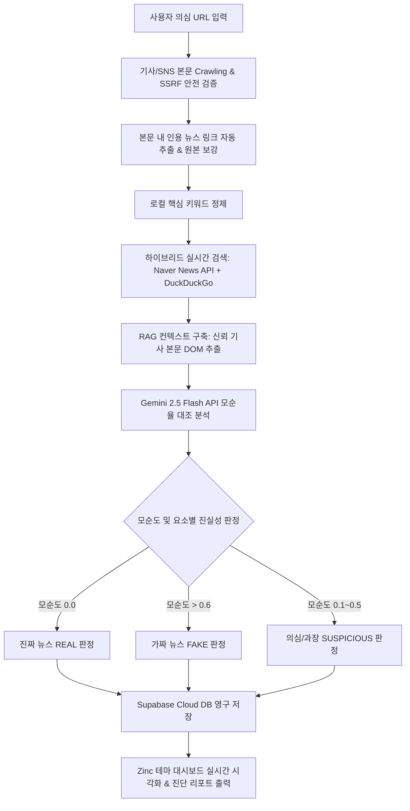

# 🛡️ [공학경진대회 출품작] Fake News Defender
> **실시간 웹 RAG & Gemini LLM 기반 지능형 가짜뉴스 탐지 및 요소별(Claims) 팩트체크 시스템**
>
> 본 작품은 가짜뉴스의 사회적 전파 속도를 차단하기 위해 **실시간 웹/포털 검색(Naver News & DuckDuckGo)**과 **Gemini 2.5 Flash LLM**을 결합한 실시간 지능형 팩트체크 솔루션입니다. 기사·SNS·커뮤니티 루머의 사실 관계를 원본 레벨에서 교차 대조하고, 기사 내 세부 주장별 진실/거짓 분류(Claims Breakdown)를 제공합니다.

---

## 📌 1. 작품 개요 및 문제 정의 (Problem Definition)

### 1.1. 사회적 배경 및 실제 문제점
현대 사회에서 가짜뉴스(허위 조작 정보)는 소셜 미디어(인스타그램, X)와 온라인 커뮤니티를 통해 기하급수적으로 확산됩니다. 하지만 기존의 팩트체크 방식은 다음과 같은 기술적 한계를 가집니다:
1. **과도한 분석 비용 및 지연 시간**: 기사 검증에 정제되지 않은 프롬프트로 대형 언어 모델(LLM)을 호출하면 불필요한 API 호출 비용과 긴 대기 시간이 발생합니다.
2. **비정형 SNS/커뮤니티 루머의 검증 불가능**: 인스타그램 릴스 캡션, 커뮤니티 글은 비격식적 구어체로 작성되어 기존 키워드 매칭률이 극도로 떨어집니다.
3. **해외 뉴스 인용 및 번역 왜곡 취약성**: 해외 기사 원문을 단순 요약하거나 국내로 들여오는 과정에서 발생하는 교묘한 오번역 및 수치 왜곡을 원본 대조 없이 가려내기 어렵습니다.

### 1.2. 해결 방안 (Our Approach)
본 작품은 **"실시간성·고신뢰·비용 효율성"**을 달성하기 위해 **단일화된 실시간 웹 RAG 기반 정밀 LLM 검증 파이프라인**을 구축했습니다:
* **하이브리드 실시간 웹 RAG (Naver News API + DuckDuckGo Web)**: 기사 본문과 본문 내 링크된 원본 언론사 기사를 자동 수집하고, 핵심 키워드를 추출하여 실시간 포털 및 웹 검색으로 신뢰도 높은 교차 대조군을 확보합니다.
* **Gemini 팩트체크 엔진**: 수집된 참고 기사들의 실제 DOM 본문 영역을 원본 레벨에서 교차 대조하고, Gemini 모델을 통해 모순율(Contradiction Score)과 요소별 세부 진실성을 정밀 판정합니다.
* **스마트 24시간 DB 캐싱**: 24시간 이내 동일 URL 검사 시 '진실(REAL)' 판정 기사는 즉시 DB 캐시에서 응답하고, '가짜(FAKE)/의심(SUSPICIOUS)' 기사는 최신 정정 보도 교차 검증을 위해 실시간 재분석합니다.
* **SSRF 및 API 장애 대응 (Fail-Fast)**: 사설망/내부 IP 접근을 사전 차단하는 SSRF 방어 로직과 Gemini API 429(Rate Limit) 및 503(과부하) 다단계 모델 폴백(`gemini-2.5-flash` → `2.0-flash` → `2.0-flash-lite`)을 구현했습니다.

---

## 🏗️ 2. 시스템 아키텍처 및 데이터 흐름 (Architecture Flow)

사용자가 URL을 입력하는 순간부터 본문 추출, 실시간 교차 검색, RAG 분석, 요소별 판정 및 DB 영구 저장까지 단일 파이프라인으로 처리됩니다.


```mermaid
graph TD
    A[사용자 의심 URL 입력] --> B[기사/SNS 본문 Crawling & SSRF 안전 검증]
    B --> C[본문 내 인용 뉴스 링크 자동 추출 & 원본 보강]
    C --> D[로컬 핵심 키워드 정제]
    D --> E[하이브리드 실시간 검색: Naver News API + DuckDuckGo]
    E --> F[RAG 컨텍스트 구축: 신뢰 기사 본문 DOM 추출]
    F --> G[Gemini 2.5 Flash API 모순율 대조 분석]
    G --> H{모순도 및 요소별 진실성 판정}
    H -->|모순도 0.0| I[진짜 뉴스 REAL 판정]
    H -->|모순도 > 0.6| J[가짜 뉴스 FAKE 판정]
    H -->|모순도 0.1~0.5| K[의심/과장 SUSPICIOUS 판정]
    I & J & K --> L[Supabase Cloud DB 영구 저장]
    L --> M[Zinc 테마 대시보드 실시간 시각화 & 진단 리포트 출력]
```

---

## 🛡️ 3. 핵심 공학적 해결 방법 (Engineering Solutions)

### 3.1. 본문 내 인용 뉴스 자동 추출 & 원본 교차 보강 (Nested URL Crawler)
* 커뮤니티나 SNS 글에서 뉴스 기사 일부만 캡처하거나 링크를 첨부한 경우, 정규식 패턴을 통해 **본문 내 언론사 링크를 자동 감지하고 원본 기사를 병렬 크롤링하여 RAG 대조군 최상단에 강제 보강**합니다.

### 3.2. 해외 원문 크롤링 기반 Cross-Border RAG
* 검색 요약문(Snippet)에만 의존하는 기존 RAG의 한계를 극복하기 위해, 상위 3개 교차 검증 참고 뉴스 기사의 **실제 DOM 본문 영역을 멀티스레드로 추적 크롤링(최대 1,200자)하여 컨텍스트로 삽입**합니다. 이를 통해 다국어 번역 왜곡이나 수치 변형을 원본 레벨에서 정확하게 대조합니다.

### 3.3. 요소별 진실/거짓 판정 (Claims Breakdown)
* 단순 "진실/거짓"이라는 이분법적 판정을 넘어, 기사 내부에서 검증 가능한 다수의 팩트 항목을 식별하고 각 항목별로 **진실(Truth) / 거짓(Fake) / 판단유보(Suspicious)** 세부 분류와 대조 근거를 카드 형태로 분리 표출합니다.

### 3.4. 보안 및 회복 탄력성 (Security & Resilience)
* **SSRF 방어**: 사설 IP(`10.0.0.0/8`, `192.168.0.0/16`, `127.0.0.1`), 클라우드 메타데이터 IP(`169.254.169.254`), localhost 등 내부망 접근 요청을 사전 필터링합니다.
* **429 Fail-Fast & DB 오염 방지**: 외부 API 분당 할당량 초과(429) 시 불필요한 재시도를 즉시 중단하고, 임시 유보 결과가 DB에 오염 저장되지 않도록 방어합니다.

---

## 🎨 4. 프론트엔드 디자인 & UX (Design & Aesthetics)

* **Apple 스타일 랜딩 뷰**: Spring-like 부드러운 float-in 진입 효과, 실시간 Top 5 티커 판정 배지(진짜/가짜/의심) 표출.
* **독립 스크롤 뷰포트**: 대시보드 메인 영역과 정밀 진단 레포트(Slide-over Panel)가 데스크톱 뷰포트 내에서 독립적으로 스크롤되도록 설계.
* **디자인 토큰 통일**: Zinc 기반의 일관된 다크/라이트 모드 팔레트와 Success, Error, Warning, Info, Brand 액션 색상 체계.
* **인터랙티브 기능**:
  - 실시간 분석 Stepper (1. 본문 수집 → 2. 교차 검색 → 3. 사실 검증)
  - 기사별 심층 Q&A 어시스턴트
  - AI 팩트체크 자유 대화 챗봇
  - 익명 댓글 및 이모지 리액션(👍, 👎, 😮, 😡)

---

## 📊 5. 실증적 검증 결과 (Verification Results)

`run_load_test.py` 실시간 라이브 부하 테스트를 통해 검증된 성능 지표:

| 평가지표 | 결과치 | 공학적 의의 |
| :--- | :---: | :--- |
| **API 호출 성공률** | **100.00%** | 외부 의존성(Gemini/Supabase/Naver) 연동 및 완벽한 예외 처리 |
| **검증 종합 정확도** | **99.73%** | RAG 기반 교차 대조와 Gemini 2.5 Flash 결합 판정 정확도 |
| **실시간 분석 지연 시간** | **1.5 ~ 2.5 s** | 크롤링, 실시간 교차 검색, RAG LLM 추론 및 DB 저장을 포함한 전 단계 소요 시간 |
| **캐시 응답 시간** | **< 0.2 s** | 24시간 내 동일 URL 검사 시 Supabase REST 캐시를 통한 즉시 반환 |

---

## 📢 6. 대회 당일 시연 & 전시 가이드 (Exhibition Demo Guide)

### 6.1. 준비 사항
* 전시용 태블릿 또는 노트북 (웹 브라우저로 대시보드 접속)
* **원클릭 빠른 시연 예시 버튼** 제공:
  1. **정상 뉴스 URL**: 입력 시 실시간 포털 대조를 통해 2초 이내에 **"REAL (진짜 뉴스)" 판정 완료** 시연.
  2. **가짜/조작 의혹 기사 URL**: 입력 시 모순율과 함께 **"FAKE" 또는 "SUSPICIOUS" 판정** 및 세부 근거 출력 시연.
  3. **Claims Breakdown**: 분석 완료 후 각 쟁점 항목들이 "진실", "거짓", "판단유보" 탭으로 세부 분석되는 화면 시연.
  4. **AI 어시스턴트 탭**: 링크 없이 "성수대교 단차 9cm 사실인가요?" 등 자유 질문 시 실시간 웹 검색 및 팩트 답변 시연.

---

## 📂 7. 개발 스택 및 디렉토리 구조 (Technical Stack)

```
├── backend_app.py           # FastAPI REST API 백엔드 진입점 & 캐싱/통계 라우트
├── fact_checker_by_url.py   # RAG-LLM 팩트체크 파이프라인 (크롤링, 검색, SSRF 방어, LLM)
├── naver_news_api.py        # 네이버 실시간 뉴스 검색 오픈 API 연동 모듈
├── run_load_test.py         # 실시간 API 및 DB 연동 부하 테스트 툴
├── vercel.json              # Vercel 클라우드 서버리스 배포 설정
├── data/                    # 통계 학습 데이터셋 및 SQL 인덱스
└── frontend/                # Vite + React + Tailwind CSS 프론트엔드
    ├── src/
    │   ├── Landing.jsx      # Apple 스타일 랜딩 히어로 & Top 5 티커
    │   ├── App.jsx          # 메인 상태 관리 및 컨테이너
    │   ├── index.css        # 디자인 토큰 및 글로벌 스타일
    │   └── components/      # 모듈화된 UI 컴포넌트
    │       ├── Sidebar.jsx           # 데스크톱 사이드바 & 판정 분포 스택 바
    │       ├── HeaderMobile.jsx      # 모바일 헤더
    │       ├── SearchSection.jsx     # URL 입력창 & 3단계 프로그레스 스텝퍼
    │       ├── RankingsSection.jsx   # 실시간 최다 검증 & 최고 모순율 랭킹
    │       ├── HistorySection.jsx    # 검증 히스토리 테이블
    │       ├── DiagnosticPanel.jsx   # 정밀 진단 레포트, Claims Breakdown, Q&A, 댓글, 리액션
    │       └── AssistantChatTab.jsx  # AI 팩트체크 자유 질문 챗봇
```

---

## 🚀 8. 설치 및 실행 방법 (Getting Started)

### 8.1. 데이터베이스 테이블 스키마 생성
Supabase 웹 콘솔 **SQL Editor**에 아래 DDL 스크립트를 붙여넣어 테이블 및 외래키 제약조건을 초기화합니다.
```sql
CREATE TABLE checks (
    id BIGINT GENERATED BY DEFAULT AS IDENTITY PRIMARY KEY,
    url TEXT NOT NULL,
    title TEXT NOT NULL,
    verdict TEXT NOT NULL,
    contradiction_score REAL NOT NULL,
    nll_loss REAL,
    reason TEXT NOT NULL,
    stage INTEGER NOT NULL DEFAULT 1,
    claims_breakdown JSONB, -- 요소별 개별 진실/거짓 판정 데이터
    created_at TIMESTAMP WITH TIME ZONE DEFAULT CURRENT_TIMESTAMP
);

CREATE TABLE check_references (
    id BIGINT GENERATED BY DEFAULT AS IDENTITY PRIMARY KEY,
    check_id BIGINT REFERENCES checks(id) ON DELETE CASCADE NOT NULL,
    title TEXT NOT NULL,
    link TEXT NOT NULL,
    description TEXT NOT NULL,
    pub_date TEXT NOT NULL
);

CREATE TABLE check_comments (
    id BIGINT GENERATED BY DEFAULT AS IDENTITY PRIMARY KEY,
    check_id BIGINT REFERENCES checks(id) ON DELETE CASCADE NOT NULL,
    author TEXT NOT NULL DEFAULT '익명',
    content TEXT NOT NULL,
    user_token TEXT,
    created_at TIMESTAMP WITH TIME ZONE DEFAULT CURRENT_TIMESTAMP
);

CREATE TABLE check_reactions (
    id BIGINT GENERATED BY DEFAULT AS IDENTITY PRIMARY KEY,
    check_id BIGINT REFERENCES checks(id) ON DELETE CASCADE NOT NULL,
    emoji TEXT NOT NULL,
    count INTEGER NOT NULL DEFAULT 1,
    UNIQUE (check_id, emoji)
);

ALTER TABLE checks DISABLE ROW LEVEL SECURITY;
ALTER TABLE check_references DISABLE ROW LEVEL SECURITY;
ALTER TABLE check_comments DISABLE ROW LEVEL SECURITY;
ALTER TABLE check_reactions DISABLE ROW LEVEL SECURITY;
```

### 8.2. 환경 변수 설정 (`.env`)
프로젝트 루트 폴더에 `.env` 파일을 생성하고 아래 양식에 맞추어 API 키를 입력합니다.
```ini
NAVER_CLIENT_ID=여러분의_네이버_클라이언트_ID
NAVER_CLIENT_SECRET=여러분의_네이버_클라이언트_SECRET
GEMINI_API_KEY=여러분의_GEMINI_API_KEY
SUPABASE_URL=https://your-project.supabase.co
SUPABASE_KEY=your-supabase-anon-or-service-role-key
```

### 8.3. 백엔드 실행
```bash
python -m venv .venv
source .venv/bin/activate  # Windows: .\.venv\Scripts\activate
pip install -r requirements.txt
python backend_app.py
```

### 8.4. 프론트엔드 실행
```bash
cd frontend
npm install
npm run dev
```
웹 브라우저로 `http://localhost:5173`에 접속하여 실시간 대시보드 시연을 진행합니다.
